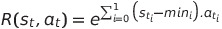
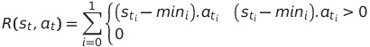
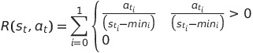

# SAiDL-assignment
This repository is the Summer Induction Assignment of Society for Artificial Intelligence and Deep Learning for the year 2021.

The attempted sections are:

1. [Reinforcement Learning](https://github.com/soham-chitnis10/SAiDL-assignment/tree/main/RL)
2. [Computer Vision](https://github.com/soham-chitnis10/SAiDL-assignment/tree/main/Computer%20Vision)
3. [Research Question](https://github.com/soham-chitnis10/SAiDL-assignment/blob/main/Research%20question.pdf)

## Reinforcement Learning
### Aim
The aim is to find minima of the functions of type 
using policy gradient with Gaussian Distribution.
### Environment description
For every episode the coefficients of the equation are randomly choosen as follows:

1. Both a and b are randomly choosen from the interval [0,10]
2. Rest of the coefficients are randomly choosen from the interval [-10,10]
3. The x and y coordinates were randomly choosen from [-4,4]
4. State is an 8 dimensional vector where x and y coordinates and the coefficeints of the function.

Maximum length of an episode is 200 steps.
### Reward Functions
Total four reward functions were implemented:

1. Inverse of the distance from the minima of the current state which only depends on the state.
2. Exponent of the sum of the product of the difference of state from the minima and action along that directions. The Reward function is 
3. The reward function is given by 
4. The reward function is given by 

### Implementation
To run the environment and agent run the ```main.py``` which can be found [here](https://github.com/soham-chitnis10/SAiDL-assignment/blob/main/RL/main.py). The environment is a custom OpenAI environment for Quadratic 2D functions which can found [here](https://github.com/soham-chitnis10/SAiDL-assignment/blob/main/RL/Quadratic_2D_env.py).

All four functions are also implemented in colab which could be found in the same [folder](https://github.com/soham-chitnis10/SAiDL-assignment/tree/main/RL)

### Analysis Of Reward Functions
The agent was trained for 3000 episodes for reward functions 1, 3 and 4. The agent was tested for 1000 episodes. Reward function 2 could not be trained more than 1000 due to overflow in exponent ,therefore, testing was not conducted on reward function 2. A successful episode is defined as the absolute differnce of particular coordinate with that state is less than 0.1. The graphs of Inverse of the distance of the last state from minima was plotted against the episodes. The peak of the graph would indicate successful episodes.

Reward function 1: Successful Training Episodes: 18/3000 Successful Testing Episodes: 6/1000 [Notebook](https://github.com/soham-chitnis10/SAiDL-assignment/blob/main/RL/Reinforcement_Learning_using_Policy_gradient.ipynb)

Reward function 3: Successful Training Episodes: 28/3000 Successful Testing Episodes: 6/1000 [Notebook](https://github.com/soham-chitnis10/SAiDL-assignment/blob/main/RL/Reinforcement_Learning_using_Policy_gradient(Reward%20function%203).ipynb)

Reward function 4: Successful Training Episodes: 9/3000 Successful Testing Episodes: 4/1000 [Notebook](https://github.com/soham-chitnis10/SAiDL-assignment/blob/main/RL/Reinforcement_Learning_using_Policy_gradient(Reward%20function%204).ipynb)

Out of the four reward functions the most successful on training is Reward function 3 which has 28 successful training episodes but does not generalize that well while testing as only 6 episodes were successful which is same as Reward function 1. Reward function 4 did not yield as expected results.The graphs of all functions are present in their respective colab notebooks.

### Experiments
As stated in the enviroment decription, that coefficents and coordinates have been limited to small range therefore some experiments were carried out on the all three reward functions. Experiments invovled changing the length of episodes, providing larger ranges to coefficents and coordinates and changing hyperparameters of the policy gradient algorithm i.e learning rate, gamma value in reward-to-go and using more deeper neural networks. On conducting these experiments it can infered that none of three reward functions generalize that well on higher ranges. It was also observed that reults in section of Analysis of Reward functions is also not consistent.

## Computer Vision

### Supervised Learning

CNN architecture: Wide ResNet 101

Epochs : 100

Data Augmentation: Resized to 272 ,Random rotation at 15 degrees ,Random Crop to 256,Random Horizontal flip 

After training for 100 epochs the test accuracy was 76.275 %

Data Augmentation was performed to increase the test accuracy of the model.

[Notebook](https://github.com/soham-chitnis10/SAiDL-assignment/blob/main/Computer%20Vision/Supervised_Learning(Baseline).ipynb) for details

### Semi-Supervised Learning

CNN architecture: ResNet 18

Epochs: (Supervised) 100 (Pseudo labeling and Co-training) 6

Data Augmentation was same as Supervsed Learning.

Best test accuracy : 59.5000 % 

Models for both of them can found [here](https://github.com/soham-chitnis10/SAiDL-assignment/tree/main/Computer%20Vision/models). Due to time constraint Psuedo labeling and Co-training was trained for 6 epochs.

[Notebook](https://github.com/soham-chitnis10/SAiDL-assignment/blob/main/Computer%20Vision/Semi_Supervised_Learning.ipynb) for more details.
